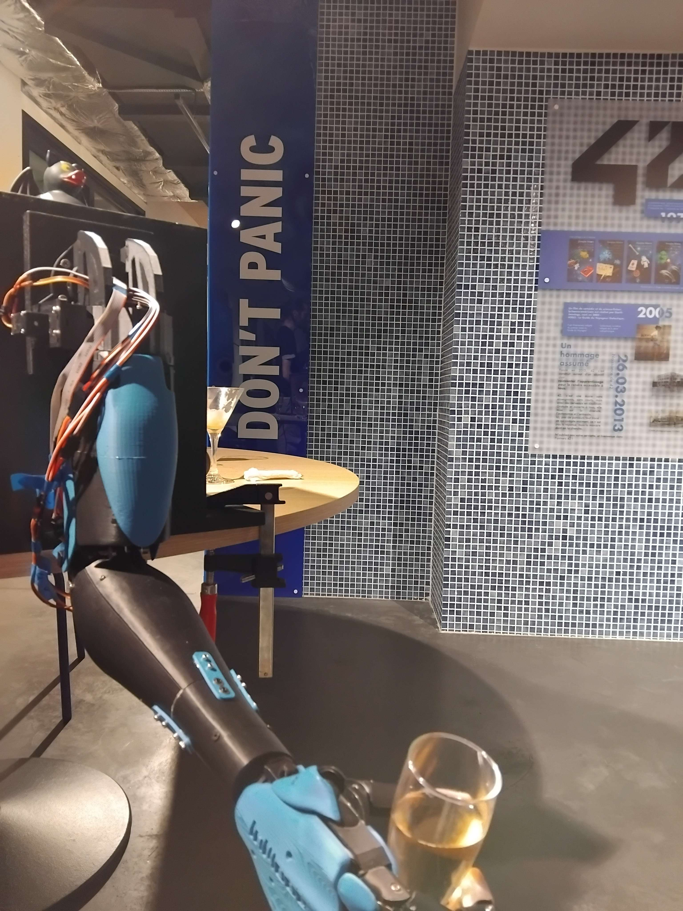

# MoovUp

MoovUp is a 3D printed robotic arm based on the [InMoov](inmoov.fr) project.

# pinout

| ArduinoMega pin | ATmega 2560 port | timer | kind   | usage    |
| :-------------: | :--------------: | :---: | :----- | :------- |
|       A1        |       PF1        |  --   | sensor | thumb    |
|       A2        |       PF2        |  --   | sensor | index    |
|       A3        |       PF3        |  --   | sensor | middle   |
|       A4        |       PF4        |  --   | sensor | ring     |
|       A5        |       PF5        |  --   | sensor | pinky    |
|       D2        |       PE4        | OC3B  | motor  | thumb    |
|       D3        |       PE5        | OC3C  | motor  | index    |
|       D5        |       PE3        | OC3A  | motor  | middle   |
|       D6        |       PH3        | OC4A  | motor  | ring     |
|       D7        |       PH4        | OC4B  | motor  | pinky    |
|       D8        |       PH5        | OC4C  | motor  | wrist    |
|       D11       |       PB5        | OC1A  | motor  | elbow    |
|       D12       |       PB6        | OC1B  | motor  | shoulder |
